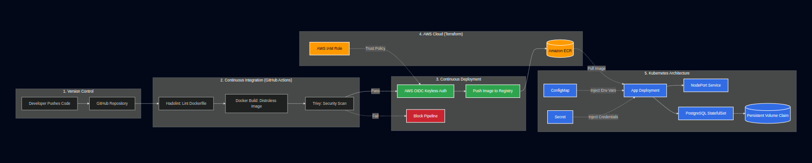

# Secure Kubernetes CI/CD Pipeline


<p align="center">
  
  
  
  
  
  
</p>

## Project Overview

This project demonstrates a **production-grade DevSecOps pipeline** designed to automate application delivery while enforcing strict security standards. It implements a secure software supply chain—from code commit to Kubernetes deployment—featuring multi-stage Distroless container builds, automated vulnerability scanning, keyless cloud authentication (OIDC), and resilient, self-healing Kubernetes workloads.

## Core Design Principles

* **Zero-Trust Containerization:** Drastically reduces the attack surface using Distroless images and enforced non-root execution.
* **Shift-Left Security:** Automated Dockerfile linting and Trivy CVE scanning in the CI phase to block vulnerabilities before registry push.
* **Keyless Authentication:** Complete elimination of hardcoded cloud credentials using OpenID Connect (OIDC) with AWS IAM.
* **High Availability & Durability:** Production-grade Kubernetes safeguards including resource limits, liveness/readiness probes, and StatefulSets for persistent data.
* **Configuration Decoupling:** Strict separation of application code from sensitive credentials using Kubernetes Secrets and ConfigMaps.

## Features

> <small>Industry-standard DevSecOps and Kubernetes practices implemented</small>

* Multi-stage Docker builds reducing image size by 95% (1.5 GB → 50 MB)
* Distroless runtime execution restricted to unprivileged `USER 1001`
* CI integration of Hadolint and Trivy to detect Critical and High CVEs
* Keyless AWS authentication via GitHub Actions OIDC
* Automated container deployment to Amazon ECR
* ConfigMap- and Secret-based dynamic configuration injection
* PostgreSQL StatefulSet with PersistentVolumeClaim (PVC)
* Explicit Pod CPU and memory requests/limits
* Automated Kubernetes self-healing via HTTP `/health` probes

## Technology Stack

| Category                  | Tools                        |
| ------------------------- | ---------------------------- |
| CI/CD & Automation        | GitHub Actions               |
| Containerization          | Docker (Multi-stage)         |
| Security & Linting        | Trivy, Hadolint              |
| Cloud Provider & Registry | AWS (IAM, OIDC, ECR)         |
| Infrastructure as Code    | Terraform                    |
| Container Orchestration   | Kubernetes (Minikube)        |
| Application Layer         | Node.js, Express, PostgreSQL |

## Project Architecture

### DevSecOps Pipeline (Continuous Integration)

* Code push triggers a GitHub Actions runner.
* **Hadolint** inspects the Dockerfile for best-practice violations.
* Multi-stage builds isolate dependencies and produce a Distroless runtime artifact.
* **Trivy** scans image layers and fails the build if Critical or High OS/library CVEs are detected.

### Keyless Delivery (Continuous Deployment)

* GitHub Actions dynamically assumes an AWS IAM role via an **OIDC** trust policy provisioned through Terraform.
* Secure, short-lived token authentication is used to access AWS ECR.
* Verified container images are tagged and pushed to the registry.

### Kubernetes Orchestration

* **Stateful Layer:** PostgreSQL is deployed through a `StatefulSet` attached to a `PersistentVolumeClaim` to ensure data survives pod restarts and rescheduling.
* **Decoupled Configuration:** Database URLs and credentials are injected securely using `ConfigMap` and `Secret` resources.
* **Application Layer:** A Kubernetes `Deployment` runs two replicas of the Node.js API.
* **Operational Safeguards:** Resource requests and limits prevent node exhaustion, while `livenessProbe` and `readinessProbe` ensure traffic is routed only to healthy pods.

## Architecture Diagram



## Repository Structure

```text
secure-k8s-cicd-pipeline/
├── .github/
│   └── workflows/
│       └── ci-cd.yml                # Build, Scan, OIDC Auth, and ECR Push
│
├── k8s/
│   ├── app-deployment.yaml          # API deployment (limits, probes, 2 replicas)
│   ├── app-service.yaml             # NodePort service exposure
│   ├── configmap.yaml               # Non-sensitive environment variables
│   ├── secret.yaml                  # Base64-encoded database credentials
│   ├── postgres-pvc.yaml            # Persistent storage claim
│   └── postgres-statefulset.yaml    # Durable database deployment
│
├── terraform/
│   └── main.tf                      # AWS ECR and OIDC trust provisioning
│
├── Dockerfile                       # Multi-stage, Distroless, USER 1001
├── app.js                           # Node.js API with Kubernetes health routes
├── .trivyignore                     # Documented risk acceptance for upstream CVEs
└── README.md
```

## Author & Project Context

**Saqlain Sheikh**
DevOps & Cloud Enthusiast
AWS • Terraform • Docker • Kubernetes • DevSecOps

This project was engineered to address modern software supply-chain vulnerabilities and deployment reliability challenges. The objective was to build a delivery pipeline that treats security as a first-class citizen—demonstrating that an application can be highly optimized, thoroughly scanned, keylessly authenticated, and durably orchestrated without sacrificing deployment speed or automation efficiency.

> **Note:**
> To deploy this pipeline and cluster locally, see the [Quick Start Guide](runbook.md).

<p align="center">
  <b>⭐ If you found this project useful, please consider starring the repository!</b>
</p>
